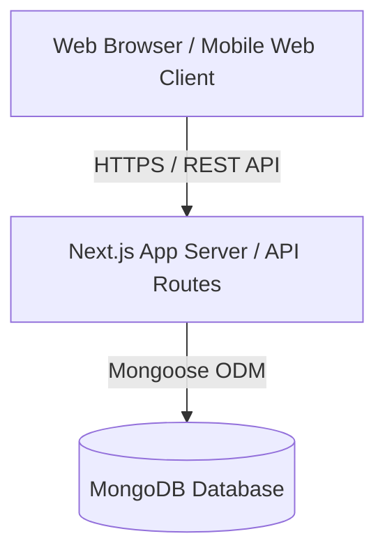
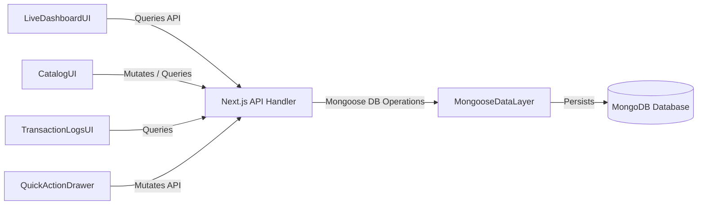
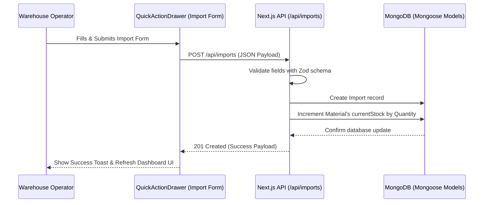
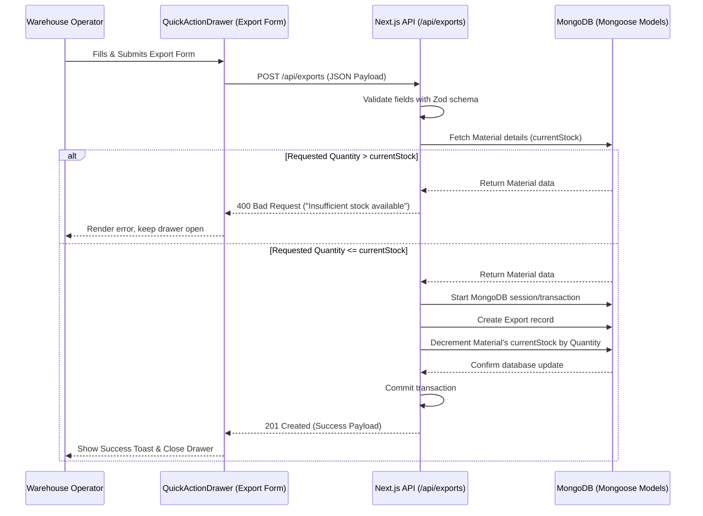
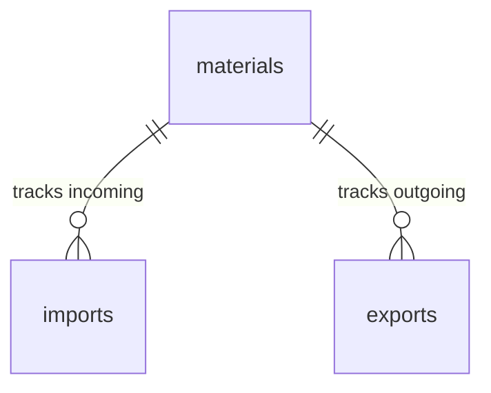

# AgriKeep Architecture Document

## Introduction

This document defines the technical architecture for AgriKeep.

**PRD Reference:** docs/prd.md

### Starter Template or Existing Project

N/A - Greenfield project startup.

### Change Log

| Date | Version | Description | Author |
|------|---------|-------------|--------|
| 2026-05-23 | 1.0 | Initial architecture | @planner |

## High Level Architecture

### Technical Summary
AgriKeep is a Next.js fullstack monolithic application designed to manage and track central farm agricultural inputs and outputs. The backend runs as Serverless Next.js API Routes, providing fast and cost-effective processing, while data is stored in MongoDB for schema flexibility. The frontend provides a premium, responsive dashboard utilizing custom Vanilla CSS for glassmorphic elements and high-performance micro-interactions.

### High Level Overview
- **Architectural Style:** Fullstack web application monolith with serverless REST API route handlers.
- **Repository Structure:** Monorepo hosting client-side layouts, server API routes, database schemas, and shared utilities.
- **Service Architecture:** Single fullstack server application connected directly to MongoDB Atlas or local MongoDB databases.

### High Level Project Diagram



### Architectural and Design Patterns
- **Layered MVC Pattern:** Decouples UI representation (React App Router) from request control logic (Next.js API route handlers) and data access models (Mongoose schemas).
- **Service Layer Pattern:** Houses transaction validation, Average Unit Price updates, and negative stock calculations in reusable, testable utility services.
- **Atomic MongoDB Updates:** Utilizes transactional operations or conditional updates (`$inc` with stock checks) to enforce data integrity and prevent concurrency race conditions during stock updates.

## Tech Stack

### Cloud Infrastructure
- **Provider:** Vercel (Frontend & Serverless API Routes) + MongoDB Atlas (Database)
- **Key Services:** Next.js Serverless Functions, MongoDB Atlas Serverless (Shared tier)
- **Deployment Regions:** ap-southeast-1 (Singapore) / us-east-1 (N. Virginia)

### Technology Stack Table

| Category | Technology | Version | Purpose | Rationale |
|----------|------------|---------|---------|-----------|
| Language | TypeScript | 5.3.x | Primary language | Strong typing, excellent autocomplete and refactoring. Strict type safety, absolute ban on `any`. |
| Runtime | Node.js | 20.x LTS | Server runtime | Stable LTS release, massive library ecosystem |
| Framework | Next.js (App Router) | 14.x | Fullstack Web App | Seamless integration of frontend React and backend serverless API routes |
| Database | MongoDB | 7.x | Primary database | High performance, document-based storage matching transaction structures |
| ODM | Mongoose | 8.x | Object Data Modeling | Dynamic database schema validation and relational references in MongoDB |
| Styling | Vanilla CSS | CSS3 | Visual styles & UI | Complete flexibility to craft glowing animations, custom dark mode variables, and glassmorphism |
| State Mgmt | TanStack React Query | v5 | Server state caching | Automatic background fetching, request caching, and query key separation per module |
| Form Library | React Hook Form | 7.x | Client form handling | Standardized form lifecycle, error management, and Zod resolver integration |
| Tables | TanStack Table | v8 (react-table) | Client table UI | Headless component for robust sorting, filtering, and paging of inventory grids |
| Testing | Vitest | 1.x | Test runner | Blazing fast ESM-first unit and integration testing |
| Validation | Zod | 3.x | Schema Validation | Whitelist validations at API boundaries (BE) and form layers (FE) |

## Data Models

### Material
**Purpose:** Represents a registered inventory item (seeds, fertilizer, tool, etc.) that can be receipted or disbursed.

**Key Attributes:**
- `id`: string (PK, MongoDB ObjectId)
- `name`: string - The unique name of the material (e.g., "Urea Fertilizer")
- `type`: string (Seeds | Fertilizers | Pesticides | Tools) - The category of agricultural supply
- `uom`: string - Unit of Measurement (e.g., "kg", "liters", "units")
- `safetyStock`: number - The threshold below which a low-stock alert is generated
- `currentStock`: number - The computed physical stock currently on hand (default 0)
- `createdAt`: Date (timestamp)
- `updatedAt`: Date (timestamp)

**Relationships:**
- Has many `Import` transaction logs
- Has many `Export` transaction logs

### Import
**Purpose:** Logs incoming materials received from suppliers to update inventory balances.

**Key Attributes:**
- `id`: string (PK, MongoDB ObjectId)
- `date`: Date - The date of the shipment receipt
- `supplierName`: string - The name of the supplying vendor
- `materialId`: string (FK -> Material) - The reference to the catalog material
- `quantity`: number - Quantity imported (must be > 0)
- `unitPrice`: number - Price per unit (must be > 0)
- `batchCode`: string (optional/recommended) - Batch identifier for safety monitoring
- `expirationDate`: Date (optional/recommended) - Batch shelf-life expiration date (recommended for chemical/seed types)
- `createdAt`: Date (timestamp)
- `updatedAt`: Date (timestamp)

**Relationships:**
- Belongs to a `Material` catalog entry

### Export
**Purpose:** Logs outgoing materials disbursed to field operators or destinations.

**Key Attributes:**
- `id`: string (PK, MongoDB ObjectId)
- `date`: Date - The date of disbursement
- `requesterName`: string - The farm operator receiving the item
- `materialId`: string (FK -> Material) - The reference to the catalog material
- `quantity`: number - Quantity disbursed (must be > 0)
- `destinationPurpose`: string - Destination/Purpose tag (e.g. "Field A", "Tool Repair")
- `createdAt`: Date (timestamp)
- `updatedAt`: Date (timestamp)

**Relationships:**
- Belongs to a `Material` catalog entry

### TypeScript Interfaces

```typescript
export type MaterialType = 'Seeds' | 'Fertilizers' | 'Pesticides' | 'Tools';

export interface IMaterial {
  id: string;
  name: string;
  type: MaterialType;
  uom: string;
  safetyStock: number;
  currentStock: number;
  createdAt: Date;
  updatedAt: Date;
}

export interface IImport {
  id: string;
  date: Date;
  supplierName: string;
  materialId: string;
  quantity: number;
  unitPrice: number;
  batchCode?: string;
  expirationDate?: Date;
  createdAt: Date;
  updatedAt: Date;
}

export interface IExport {
  id: string;
  date: Date;
  requesterName: string;
  materialId: string;
  quantity: number;
  destinationPurpose: string;
  createdAt: Date;
  updatedAt: Date;
}
```

## Components

### LiveDashboardUI
**Responsibility:** Displays real-time summary statistics, near-expiry warning lists, and low-stock alerts.
**Key Interfaces:** Interacts with the browser DOM, fetches and displays KPI counts.
**Dependencies:** TanStack Query API client, alert-indicator sub-components.
**Technology Stack:** React, Vanilla CSS.

### CatalogUI
**Responsibility:** Renders a list/grid of materials, search input, type filters, and edit forms.
**Key Interfaces:** Renders editable tables or detail views. Uses `GenericTable` for listing and `GenericForm` in modals.
**Dependencies:** Material APIs, QuickActionDrawer component, `GenericTable`, `GenericForm`.
**Technology Stack:** React, Vanilla CSS.

### TransactionLogsUI
**Responsibility:** Provides unified history tables for imports and exports, color-coded for ease of recognition.
**Key Interfaces:** Renders tabular lists sorted by date descending. Uses `GenericTable` for data display.
**Dependencies:** Import and Export APIs, `GenericTable`.
**Technology Stack:** React, Vanilla CSS.

### QuickActionDrawer
**Responsibility:** A slide-in dialog enabling warehouse operators to log new imports/exports from anywhere in the app. Uses `GenericForm` with customized field schemas.
**Key Interfaces:** Exposes open/close functions; validates form submissions.
**Dependencies:** React, Zod validations, `GenericForm`.
**Technology Stack:** React, Vanilla CSS.

### Shared Generic UI Components

#### GenericForm
**Responsibility:** A type-safe, generic form wrapper built on top of `react-hook-form` that dynamically initiates a form context using `@hookform/resolvers/zod`. It manages child input elements, handles loading/submission states, prevents default submission, and propagates parsed payload parameters.
**Key Interfaces:** Accepts `schema` (Zod schema), `defaultValues`, `onSubmit` callback, and children elements.
**Dependencies:** `react-hook-form`, `zod`, `@hookform/resolvers/zod`.

#### GenericTable
**Responsibility:** A headless, highly reusable layout grid component leveraging `@tanstack/react-table`. It dynamically parses generic records (`T[]`) and column metadata (`ColumnDef<T>[]`) to render standard tabular grids supporting cell actions, chronological sorting, search filtering, and paginated footers.
**Key Interfaces:** Accepts `data`, `columns`, sorting options, and page controls.
**Dependencies:** `@tanstack/react-table`, Vanilla CSS.

#### FormFieldItem & FormError
**Responsibility:** Standardized form fields (Text inputs, Select lists, Date Pickers) that integrate with the `react-hook-form` context. FormError automatically checks the form state for any active errors corresponding to the field's `name` attribute and renders a user-friendly error message in a high-visibility red font below the input, highlighting the input border in a glowing red.
**Key Interfaces:** Input fields containing validation parameters mapped to Zod schema elements.
**Dependencies:** `react-hook-form`, Vanilla CSS.

### MongooseDataLayer
**Responsibility:** Governs MongoDB validation and schema enforcement.
**Key Interfaces:** Mongoose Model wrappers (`Material`, `Import`, `Export`).
**Dependencies:** MongoDB node package, Mongoose.
**Technology Stack:** Node.js, Mongoose.

### Component Diagrams



## External APIs

No external API integrations required.

## Core Workflows

### Import Logging Workflow



### Export Logging Workflow with Negative Inventory Check



## REST API Spec

### API Style
REST API

### Base URL
`/api`

### Unified Response Format
All backend API routes must strictly wrap returned payloads in a standardized, typed JSON envelope structure. No raw model arrays or objects should be sent directly.

```typescript
export interface IApiResponse<T> {
  data: T;
  meta?: {
    page: number;
    limit: number;
    total: number;
  };
}
```

- All queries returning lists of items (e.g. materials, imports, exports) must return a payload conforming to `IApiResponse<T[]>` with the `meta` attribute containing page, limit, and total count metadata.
- All creation (POST) or update (PUT) endpoints must return the affected record under `IApiResponse<T>`.

### Authentication
Simulated/Simplified Session authentication checking headers for administrative requests (Farm Manager roles).

### Endpoints

#### Material Catalog

| Method | Endpoint | Description | Auth |
|--------|----------|-------------|------|
| GET | `/api/materials` | List all materials, sorted alphabetically by name | No |
| POST | `/api/materials` | Create a new catalog material item | Yes |
| PUT | `/api/materials/:id` | Edit safety threshold/name of an existing item | Yes |

#### Import Transactions

| Method | Endpoint | Description | Auth |
|--------|----------|-------------|------|
| GET | `/api/imports` | List all incoming transaction records, sorted by date descending | No |
| POST | `/api/imports` | Record a new incoming stock delivery | Yes |

#### Export Transactions

| Method | Endpoint | Description | Auth |
|--------|----------|-------------|------|
| GET | `/api/exports` | List all outgoing disbursements, sorted by date descending | No |
| POST | `/api/exports` | Record a new stock disbursement (performs stock checks) | Yes |

## Database Schema

### Tables/Collections

#### materials
| Column | Type | Constraints | Description |
|--------|------|-------------|-------------|
| `_id` | ObjectId | PK | Primary Key |
| `name` | String | Unique, Required | Unique name of the item |
| `type` | String | Required, Enum | Seeds, Fertilizers, Pesticides, Tools |
| `uom` | String | Required | Unit of Measurement (e.g. kg, liters) |
| `safetyStock` | Number | Required, >= 0 | Low stock alert threshold |
| `currentStock` | Number | Required, >= 0 | Computed real-time stock-on-hand |
| `createdAt` | Date | Default: Now | Auto-generated timestamp |
| `updatedAt` | Date | Default: Now | Auto-generated timestamp |

#### imports
| Column | Type | Constraints | Description |
|--------|------|-------------|-------------|
| `_id` | ObjectId | PK | Primary Key |
| `date` | Date | Required | Date of delivery |
| `supplierName` | String | Required | Supplier name |
| `materialId` | ObjectId | FK -> materials, Required | Reference to the material item |
| `quantity` | Number | Required, > 0 | Amount of supply received |
| `unitPrice` | Number | Required, > 0 | Unit cost in transaction |
| `batchCode` | String | Optional | Manufacturer batch tracking code |
| `expirationDate` | Date | Optional | Required for Seeds/Chemicals |
| `createdAt` | Date | Default: Now | Auto-generated timestamp |
| `updatedAt` | Date | Default: Now | Auto-generated timestamp |

#### exports
| Column | Type | Constraints | Description |
|--------|------|-------------|-------------|
| `_id` | ObjectId | PK | Primary Key |
| `date` | Date | Required | Date of disbursement |
| `requesterName` | String | Required | Name of the staff requester |
| `materialId` | ObjectId | FK -> materials, Required | Reference to the material item |
| `quantity` | Number | Required, > 0 | Amount of supply disbursed |
| `destinationPurpose` | String | Required | Destination tag or crop category |
| `createdAt` | Date | Default: Now | Auto-generated timestamp |
| `updatedAt` | Date | Default: Now | Auto-generated timestamp |

### Indexes
- **materials:** `{ name: 1 }` (unique) for fast alphabetical queries and unique names; `{ type: 1 }` for classification filtering.
- **imports:** `{ date: -1 }` for transaction logs feed; `{ materialId: 1 }` for relational lookups.
- **exports:** `{ date: -1 }` for transaction logs feed; `{ materialId: 1 }` for relational lookups.

### Entity Relationship Diagram



### Migrations Strategy
Dynamic Mongoose Schemas manage database structure programmatically. A `seed.ts` script will populate core demo items into the `materials` collection for staging/development.

## Source Tree

```
project-root/
├── .bmad-lite/          # BMAD-Lite configurations and guidelines
├── docs/                # Monolithic requirements and architecture documentation
│   ├── prd.md
│   └── project-brief.md
├── src/
│   ├── app/             # Next.js App Router
│   │   ├── layout.tsx   # Global styling and Outfit font injection
│   │   ├── page.tsx     # Real-time Live Dashboard
│   │   ├── catalog/     # Material Catalog Management
│   │   │   └── page.tsx
│   │   ├── history/     # Unified Imports/Exports history feed
│   │   │   └── page.tsx
│   │   └── api/         # Next.js Serverless API routes
│   │       ├── materials/
│   │       │   └── route.ts
│   │       ├── imports/
│   │       │   └── route.ts
│   │       └── exports/
│   │           └── route.ts
│   ├── components/      # UI components (Layout, modals, Forms)
│   │   ├── Sidebar.tsx  # Navigation pane
│   │   ├── QuickActionDrawer.tsx # Fast transaction logger drawer
│   │   └── forms/       # Import and Export validation forms
│   ├── models/          # Mongoose database models
│   │   ├── Material.ts
│   │   ├── Import.ts
│   │   └── Export.ts
│   ├── lib/             # Third-party configuration and DB connections
│   │   ├── dbConnect.ts
│   │   └── utils.ts
│   └── styles/          # Custom Vanilla CSS
│       ├── globals.css  # CSS custom properties, resets, light/dark themes
│       ├── layout.css   # Main dashboard grid and sidebar structure
│       └── glass.css    # Premium glassmorphic utility rules
├── tests/
│   ├── unit/            # Stock computations and schema tests
│   └── integration/     # Next.js Serverless endpoints and stock verification
├── package.json
├── tsconfig.json
└── next.config.js
```

## Infrastructure and Deployment

### Infrastructure as Code
- **Tool:** N/A (Serverless Vercel git integration)
- **Location:** None
- **Approach:** Auto-provisioned serverless environments through deployment webhooks.

### Deployment Strategy
- **Strategy:** Serverless edge deployments with previews on Pull Requests.
- **CI/CD Platform:** GitHub Actions (linting and testing) and Vercel Git Integration (build and hosting).

### Environments
- **Development:** Local host running `next dev` connected to a local MongoDB Docker container.
- **Staging:** Vercel staging deployment mapped to preview branches connected to a MongoDB Atlas Staging cluster.
- **Production:** Vercel production deployment mapped to the `main` branch connected to a MongoDB Atlas Production cluster.

### Environment Promotion Flow
```
Development → GitHub Pull Request (Staging Preview) → Merge to main (Production Deploy)
```

### Rollback Strategy
- **Primary Method:** Vercel Instant Rollback to a prior validated deployment.
- **Trigger Conditions:** Critical functional failure or database degradation on main.
- **Recovery Time Objective:** RTO < 30 seconds.

## Error Handling Strategy

### General Approach
API endpoints return standard HTTP status codes combined with an RFC-compliant JSON payload containing user-friendly errors.

### Logging Standards
- **Library:** Winston / Native console wrappers.
- **Format:** JSON structured logs in production; colorized text logs in development.
- **Levels:** DEBUG, INFO, WARN, ERROR.

### Error Handling Patterns

#### External API Errors
N/A (No external APIs).

#### Business Logic Errors
- **Custom Exceptions:** `ValidationError`, `InsufficientStockError`, `DatabaseConnectionError`.
- **User-Facing Errors:** Input fields highlight error messages from Zod schemas; stock check failures display a global red toast message.

#### Data Consistency
Stock increments and decrements use atomic operations (`$inc`) and check available levels to prevent double-spending or negative balances.

## Coding Standards

### Core Standards
- **Languages & Runtimes:** TypeScript 5.3.x, Node.js 20.x
- **Style & Linting:** ESLint + Prettier rules
- **Test Organization:** Tests located under `/tests` folder, divided into `/tests/unit` and `/tests/integration`.

### Naming Conventions
| Element | Convention | Example |
|---------|------------|---------|
| Files | kebab-case | custom-toast.tsx |
| Components | PascalCase | QuickActionDrawer.tsx |
| Functions | camelCase | calculateStockTotal |

### Critical Rules
- **Rule 1 (English Only Policy):** All source files, comments, PRDs, and architecture documents MUST be written entirely in English.
- **Rule 2 (Complete Type Safety - Ban on `any`):** The `any` keyword is strictly prohibited throughout the entire codebase (both frontend and backend). Every single variable, function parameter, query parameter, mutation payload, and response object must feature explicit, strong TypeScript typing. Use generics, interface inheritance, or `unknown` with type guards if a type is highly dynamic.
- **Rule 3 (Dual-Layer Data Validation - BE & FE):** Data validation must occur independently on both layers:
  - **Frontend:** validated using `react-hook-form` paired with a Zod schema resolver (`@hookform/resolvers/zod`) to reject invalid inputs before API invocation.
  - **Backend:** validated in Next.js Serverless API handlers using Zod parsing (`parse` or `safeParse`) at the API route boundary before querying database schemas.
- **Rule 4 (Decoupled Query & Mutation Modules):** Query hooks and mutation hooks must be decoupled and organized per business domain module (e.g. `queries.ts` and `mutations.ts` within the respective feature directories). Do not merge queries and mutations in the same files.
- **Rule 5 (Centralized Query Key Management):** All query keys must be managed in a centralized key factory dictionary (e.g., in `src/lib/query-keys.ts`) to maintain consistency and prevent stale cache/cache invalidation mismatch bugs.
- **Rule 6 (Decoupled UI Side Effects in Mutations):** Mutation custom hooks must be pure and free of direct UI notifications (such as `toast.success()`, browser `alert()`, or toast side effects). They must bubble success and error statuses back to calling UI components using callback parameters (`onSuccess`, `onError`) so that representation components maintain exclusive control over UI interactions.
- **Rule 7 (Strict Type Bindings for Queries & Mutations):** Every query and mutation custom hook must enforce strict type bindings on input variables, options, and server returns (e.g., `useMutation<IApiResponse<IMaterial>, Error, ICreateMaterialDto>`).
- **Rule 8 (Negative Inventory Prevention):** The system must never accept an export transaction that exceeds the available stock on hand. This is validated on both FE (form state checks) and BE (Mongoose transactions).

## Test Strategy and Standards

### Testing Philosophy
- **Approach:** Test-after model schema drafting; test-driven validations on core stock levels.
- **Coverage Goals:** 80% coverage on database models, transaction calculations, and API routes.
- **Test Pyramid:** Focus on unit tests for model validations and integration tests for route boundaries.

### Test Types and Organization

#### Unit Tests
- **Framework:** Vitest
- **File Convention:** `*.test.ts`
- **Location:** `tests/unit/`
- **Mocking Library:** native Vitest spies
- **Coverage Requirement:** 80% on schema hooks and data checks.

#### Integration Tests
- **Scope:** API routes validation, MongoDB transactional updates.
- **Location:** `tests/integration/`
- **Test Infrastructure:** In-memory MongoDB Server (e.g. `mongodb-memory-server`) to mock active database interactions during test pipelines.

### Test Data Management
- **Strategy:** Seed new isolation models for every runner cycle.
- **Fixtures:** `tests/fixtures/`
- **Cleanup:** Clear collection entries in `afterEach()` hooks.

### Continuous Testing
Run ESLint, Prettier, and Vitest test commands on every pull request push via GitHub Actions.

## Security

### Input Validation
- **Validation Library:** Zod
- **Validation Location:** API route boundary
- **Required Rules:** Strict whitelist verification, stripping undocumented payload fields.

### Authentication & Authorization
- **Auth Method:** Session-based authentication or simple authentication cookie.
- **Session Management:** Stored securely in httpOnly cookies.

### Secrets Management
- **Development:** git-ignored `.env.local` file.
- **Production:** Vercel Environment Variables console.
- **Code Requirements:** NEVER commit secrets or credentials.

### API Security
- **Rate Limiting:** Next.js rate limiting middleware (100 requests per 15-minute window for transaction APIs).
- **CORS Policy:** Restrict queries to the web app's host domain.
- **HTTPS Enforcement:** Enforced natively by Vercel.

### Data Protection
- **Encryption at Rest:** MongoDB Atlas default storage encryption (AES-256).
- **Encryption in Transit:** Mandatory TLS 1.3 for database connection and API routes.

## Checklist Results Report
Skipped - Initial architectural setup.

## Next Steps

### Frontend Architecture
Create custom CSS utility styles (`src/styles/glass.css`) to define modern glassmorphism (backdrop-filter blurs, transparent slate borders) and custom variable palettes featuring deep forest greens and vibrant alert ambers.

### Development
1. Run `@executor draft-story` to create the first catalog story.
2. Link development tests directly to these architecture definitions.
3. Establish active progress monitoring in `docs/progress.md`.
