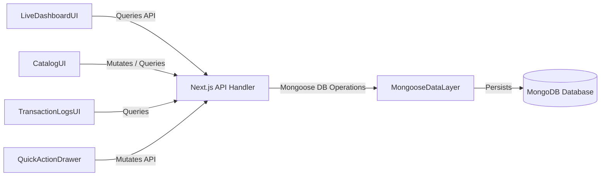

# Components

## LiveDashboardUI
**Responsibility:** Displays real-time summary statistics, near-expiry warning lists, and low-stock alerts.
**Key Interfaces:** Interacts with the browser DOM, fetches and displays KPI counts.
**Dependencies:** TanStack Query API client, alert-indicator sub-components.
**Technology Stack:** React, Vanilla CSS.

## CatalogUI
**Responsibility:** Renders a list/grid of materials, search input, type filters, and edit forms.
**Key Interfaces:** Renders editable tables or detail views. Uses `GenericTable` for listing and `GenericForm` in modals.
**Dependencies:** Material APIs, QuickActionDrawer component, `GenericTable`, `GenericForm`.
**Technology Stack:** React, Vanilla CSS.

## TransactionLogsUI
**Responsibility:** Provides unified history tables for imports and exports, color-coded for ease of recognition.
**Key Interfaces:** Renders tabular lists sorted by date descending. Uses `GenericTable` for data display.
**Dependencies:** Import and Export APIs, `GenericTable`.
**Technology Stack:** React, Vanilla CSS.

## QuickActionDrawer
**Responsibility:** A slide-in dialog enabling warehouse operators to log new imports/exports from anywhere in the app. Uses `GenericForm` with customized field schemas.
**Key Interfaces:** Exposes open/close functions; validates form submissions.
**Dependencies:** React, Zod validations, `GenericForm`.
**Technology Stack:** React, Vanilla CSS.

## Shared Generic UI Components

### GenericForm
**Responsibility:** A type-safe, generic form wrapper built on top of `react-hook-form` that dynamically initiates a form context using `@hookform/resolvers/zod`. It manages child input elements, handles loading/submission states, prevents default submission, and propagates parsed payload parameters.
**Key Interfaces:** Accepts `schema` (Zod schema), `defaultValues`, `onSubmit` callback, and children elements.
**Dependencies:** `react-hook-form`, `zod`, `@hookform/resolvers/zod`.

### GenericTable
**Responsibility:** A headless, highly reusable layout grid component leveraging `@tanstack/react-table`. It dynamically parses generic records (`T[]`) and column metadata (`ColumnDef<T>[]`) to render standard tabular grids supporting cell actions, chronological sorting, search filtering, and paginated footers.
**Key Interfaces:** Accepts `data`, `columns`, sorting options, and page controls.
**Dependencies:** `@tanstack/react-table`, Vanilla CSS.

### FormFieldItem & FormError
**Responsibility:** Standardized form fields (Text inputs, Select lists, Date Pickers) that integrate with the `react-hook-form` context. FormError automatically checks the form state for any active errors corresponding to the field's `name` attribute and renders a user-friendly error message in a high-visibility red font below the input, highlighting the input border in a glowing red.
**Key Interfaces:** Input fields containing validation parameters mapped to Zod schema elements.
**Dependencies:** `react-hook-form`, Vanilla CSS.

## MongooseDataLayer
**Responsibility:** Governs MongoDB validation and schema enforcement.
**Key Interfaces:** Mongoose Model wrappers (`Material`, `Import`, `Export`).
**Dependencies:** MongoDB node package, Mongoose.
**Technology Stack:** Node.js, Mongoose.

## Component Diagrams

