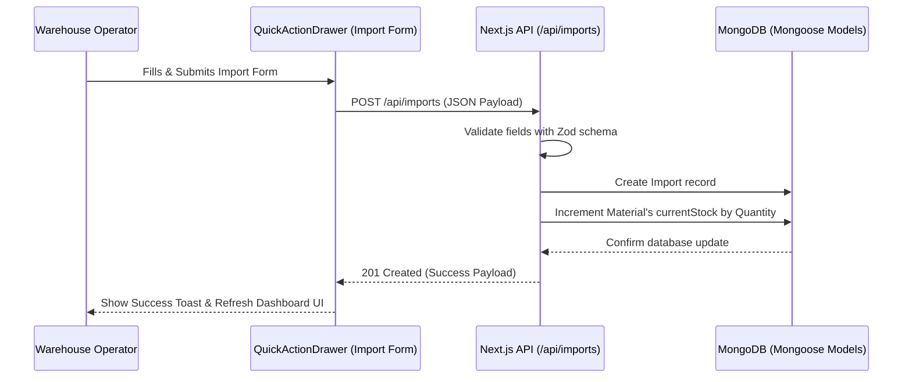
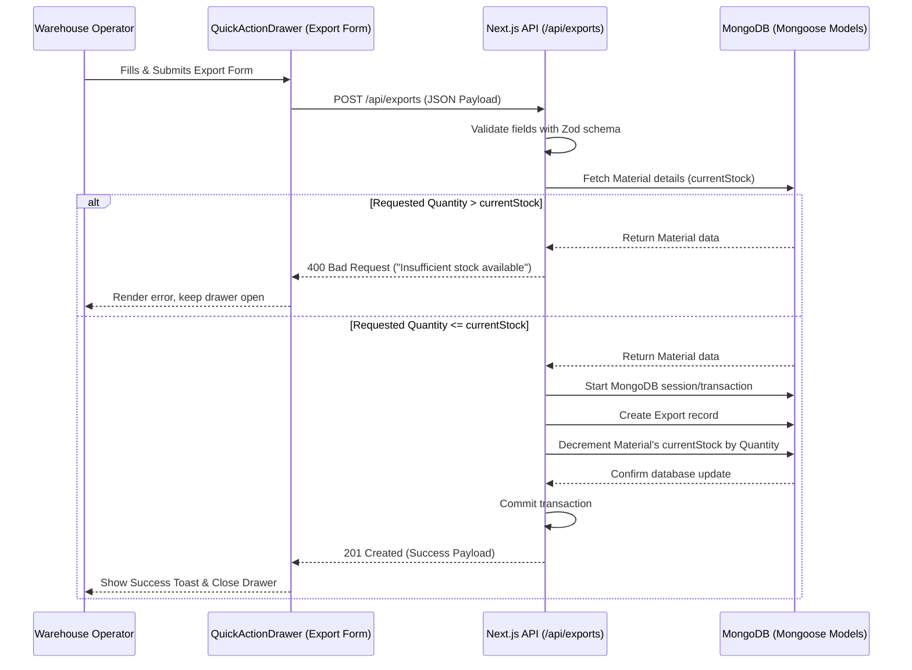

# Core Workflows

## Import Logging Workflow

```mermaid
sequenceDiagram
    participant Operator as Warehouse Operator
    participant UI as QuickActionDrawer (Import Form)
    participant API as Next.js API (/api/imports)
    participant DB as MongoDB (Mongoose Models)

    Operator->>UI: Fills & Submits Import Form
    UI->>API: POST /api/imports (JSON Payload)
    API->>API: Validate fields with Zod schema
    API->>DB: Create Import record
    API->>DB: Increment Material's currentStock by Quantity
    DB-->>API: Confirm database update
    API-->>UI: 201 Created (Success Payload)
    UI-->>Operator: Show Success Toast & Refresh Dashboard UI
```

## Export Logging Workflow with Negative Inventory Check

```mermaid
sequenceDiagram
    participant Operator as Warehouse Operator
    participant UI as QuickActionDrawer (Export Form)
    participant API as Next.js API (/api/exports)
    participant DB as MongoDB (Mongoose Models)

    Operator->>UI: Fills & Submits Export Form
    UI->>API: POST /api/exports (JSON Payload)
    API->>API: Validate fields with Zod schema
    API->>DB: Fetch Material details (currentStock)
    alt Requested Quantity > currentStock
        DB-->>API: Return Material data
        API-->>UI: 400 Bad Request ("Insufficient stock available")
        UI-->>Operator: Render error, keep drawer open
    else Requested Quantity <= currentStock
        DB-->>API: Return Material data
        API->>DB: Start MongoDB session/transaction
        API->>DB: Create Export record
        API->>DB: Decrement Material's currentStock by Quantity
        DB-->>API: Confirm database update
        API->>API: Commit transaction
        API-->>UI: 201 Created (Success Payload)
        UI-->>Operator: Show Success Toast & Close Drawer
    end
```
