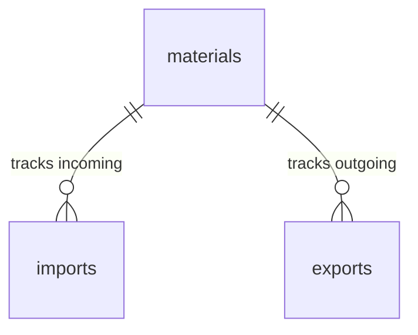

# Database Schema

## Tables/Collections

### materials
| Column | Type | Constraints | Description |
|--------|------|-------------|-------------|
| `_id` | ObjectId | PK | Primary Key |
| `name` | String | Unique, Required | Unique name of the item |
| `type` | String | Required, Enum | Seeds, Fertilizers, Pesticides, Tools |
| `uom` | String | Required | Unit of Measurement (e.g. kg, liters) |
| `safetyStock` | Number | Required, >= 0 | Low stock alert threshold |
| `currentStock` | Number | Required, >= 0 | Computed real-time stock-on-hand |
| `createdAt` | Date | Default: Now | Auto-generated timestamp |
| `updatedAt` | Date | Default: Now | Auto-generated timestamp |

### imports
| Column | Type | Constraints | Description |
|--------|------|-------------|-------------|
| `_id` | ObjectId | PK | Primary Key |
| `date` | Date | Required | Date of delivery |
| `supplierName` | String | Required | Supplier name |
| `materialId` | ObjectId | FK -> materials, Required | Reference to the material item |
| `quantity` | Number | Required, > 0 | Amount of supply received |
| `unitPrice` | Number | Required, > 0 | Unit cost in transaction |
| `batchCode` | String | Optional | Manufacturer batch tracking code |
| `expirationDate` | Date | Optional | Required for Seeds/Chemicals |
| `createdAt` | Date | Default: Now | Auto-generated timestamp |
| `updatedAt` | Date | Default: Now | Auto-generated timestamp |

### exports
| Column | Type | Constraints | Description |
|--------|------|-------------|-------------|
| `_id` | ObjectId | PK | Primary Key |
| `date` | Date | Required | Date of disbursement |
| `requesterName` | String | Required | Name of the staff requester |
| `materialId` | ObjectId | FK -> materials, Required | Reference to the material item |
| `quantity` | Number | Required, > 0 | Amount of supply disbursed |
| `destinationPurpose` | String | Required | Destination tag or crop category |
| `createdAt` | Date | Default: Now | Auto-generated timestamp |
| `updatedAt` | Date | Default: Now | Auto-generated timestamp |

## Indexes
- **materials:** `{ name: 1 }` (unique) for fast alphabetical queries and unique names; `{ type: 1 }` for classification filtering.
- **imports:** `{ date: -1 }` for transaction logs feed; `{ materialId: 1 }` for relational lookups.
- **exports:** `{ date: -1 }` for transaction logs feed; `{ materialId: 1 }` for relational lookups.

## Entity Relationship Diagram

## Migrations Strategy
Dynamic Mongoose Schemas manage database structure programmatically. A `seed.ts` script will populate core demo items into the `materials` collection for staging/development.
