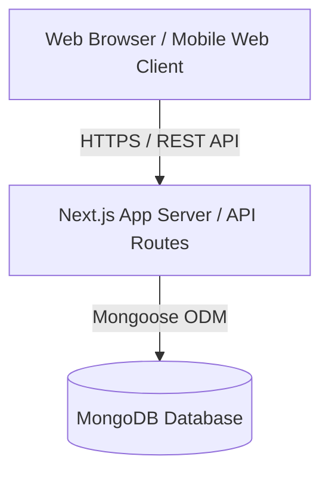

# High Level Architecture

## Technical Summary
AgriKeep is a Next.js fullstack monolithic application designed to manage and track central farm agricultural inputs and outputs. The backend runs as Serverless Next.js API Routes, providing fast and cost-effective processing, while data is stored in MongoDB for schema flexibility. The frontend provides a premium, responsive dashboard utilizing custom Vanilla CSS for glassmorphic elements and high-performance micro-interactions.

## High Level Overview
- **Architectural Style:** Fullstack web application monolith with serverless REST API route handlers.
- **Repository Structure:** Monorepo hosting client-side layouts, server API routes, database schemas, and shared utilities.
- **Service Architecture:** Single fullstack server application connected directly to MongoDB Atlas or local MongoDB databases.

## High Level Project Diagram

## Architectural and Design Patterns
- **Layered MVC Pattern:** Decouples UI representation (React App Router) from request control logic (Next.js API route handlers) and data access models (Mongoose schemas).
- **Service Layer Pattern:** Houses transaction validation, Average Unit Price updates, and negative stock calculations in reusable, testable utility services.
- **Atomic MongoDB Updates:** Utilizes transactional operations or conditional updates (`$inc` with stock checks) to enforce data integrity and prevent concurrency race conditions during stock updates.
